# ARGUS Supremum Roadmap — June 12, 2026

> **Sources:** 8 EXA searches (Apr–Jun 2026) + Perplexity Research response (Jun 12, 2026) + 51 days until EU AI Act Art. 12/19/26 enforcement.
> **Methodology:** cross-reference both sources, resolve divergences with evidence, generate dependency graph, deliver phased plan.
> **Goal:** one file, definitive, no further iteration needed.

---

## 1. Cross-Reference Matrix

| # | Dimension | EXA finding | Perplexity finding | Convergence | Resolution |
|---|-----------|-------------|---------------------|-------------|------------|
| 1.1 | UI competitor gap | CodeRabbit Change Stack = "layer-by-layer walkthrough" | Same + adds "cohort view" port (12-18h) | ✅ Agreed | Port cohort view (15h) |
| 1.2 | Agent hand-off | Severity + handoff JSON | Same + concrete `fix_plan.json` schema (6h) | ✅ Agreed | Emit `fix_plan.json` |
| 1.3 | Benchmarking | No shared F1 standard | CodeRabbit 51.2% on Martian; benchmarks untrustworthy | ✅ Agreed | Don't chase F1, lead on accountability |
| 2.1 | Art. 12 schema | `certifieddata/ai-decision-logging-spec` Apr 2026: 2 conformance levels, JSON schema | 7 specific fields needed + 51 days to deadline | ✅ Agreed | Adopt spec + add 7 fields (4h) |
| 2.2 | Evidence export | NDJSON with hash proof | Same (6h) | ✅ Agreed | NDJSON export endpoint |
| 2.3 | GDPR liability | Hash, don't store cleartext | Same + "derivative liability" framing | ✅ Agreed | Hash only |
| 2.4 | Retention | 6mo min, 24mo recommended, 7yr for Annex III | Show in `argus health` warn if <180d | ✅ Agreed | Surface in health (1h) |
| 3.1 | Framework migration | Stay custom (CordonEnforcer is moat) | Same | ✅ Agreed | Stay custom |
| 3.2 | Circuit breaker | Recommended via `llm-retry` pattern | Concrete code example (4h) | ✅ Agreed | Adopt from Perplexity |
| 3.3 | A2A Protocol | OpenFang supports A2A + MCP | `a2a-rust` v1.0 pure Rust, Axum+reqwest (in dep tree) | ✅ Agreed | Expose specialists as AgentCards (8h, opt-in) |
| 4.1 | Model defaults | Kimi K2.6 / Nemotron 3 Ultra / GLM-5.1 | deepseek-v4-flash (slop) / nemotron-3-super-120b (arch/sec) / glm-5.1 (verdict) | ⚠️ Divergent | **Take Perplexity's** — Nemotron 3 Ultra is NGC enterprise (paid), Super 120B is free tier |
| 4.2 | Rate limit handling | Not addressed | 40 RPM free tier = ~10 PR/min with 4 parallel | ✅ New finding | Add rate-limit awareness |
| 4.3 | Cost tracking | Not addressed | Log `input_tokens`/`output_tokens`/`estimated_cost_usd` per call | ✅ New finding | Add to AuditEvent (2h) |
| 5.1 | Deterministic slop | Shell out to `deslop` (Rust-native, 350 rules) | Build with `syn` AST in `argus-slop` (12-14h) | ⚠️ Divergent | **Take Perplexity's** — `syn` is already a dep, no external binary, fully integrated, no Node/npm |
| 5.2 | Hybrid validation | `Pith:2603.27130` heuristic+LLM | aislop reduced FP by 38% across 70 repos | ✅ Agreed | Hybrid is industry standard |
| 5.3 | AisLop CI badge | Not in my research | "aislop scans itself" virtuous loop (3h) | ✅ New finding | Add CI badge |
| 6.1 | Graceful shutdown | 9-phase pattern from atharvapandey | Simpler version with `with_graceful_shutdown` (2h) | ✅ Agreed | Use Perplexity's simpler version |
| 6.2 | Idempotency | Not in my research | X-Idempotency-Key header (3h) | ✅ New finding | Add to POST /analyze |
| 6.3 | OpenTelemetry | OtelAxumLayer + tracing-opentelemetry 0.33 | tracing-opentelemetry + OTLP stdout exporter (6h) | ✅ Agreed | OTLP stdout for Fly.io |
| 6.4 | SQLite migration | "Don't add Postgres yet" | SQLite for Fly free tier (8h) | ✅ Agreed | SQLite when needed, not now |
| 7.1 | HeyGen integration | Integrate HeyGen $5 pay-as-you-go | **Do NOT integrate**. Deeplink only (1h) | ❌ **Major divergence** | **Take Perplexity's** — $460/yr D-ID or $78/yr HeyGen kills $0.05/dev/month story. Deeplink = 80% wow, 0% cost |
| 7.2 | BYVK opt-in | Not addressed | Optional behind feature flag (8h) | ✅ New finding | Defer until user asks |
| 8.1 | SPIFFE ID | Adopt `spiffe` crate v0.15 | Same + JWT-SVID spec compliance (aud+exp+jti) (3h) | ✅ Agreed | Both: crate + spec compliance |
| 8.2 | SPIRE server | Skip (no K8s) | Same + doc comment (0.5h) | ✅ Agreed | Document choice |
| 8.3 | NIST NCCoE | Noted as future-proofing | Same | ✅ Agreed | Mention in README |

**Score: 22/24 agreed, 2 resolved divergences. 6 new findings from Perplexity.**

---

## 2. The Dependency Graph

```mermaid
graph TD
    %% Phase 0 - Pre-deadline (Aug 2, 2026 = 51 days)
    P0_1["4.1 Model swap per role<br/>2h"]:::critical
    P0_2["6.1 Graceful shutdown<br/>2h"]:::critical
    P0_3["2.1 AuditEvent Art.12 fields<br/>4h"]:::critical
    P0_4["3.1 LLM circuit breaker<br/>4h"]:::critical
    
    P0_3 --> P0_5["2.2 NDJSON export<br/>6h"]:::critical
    P0_3 --> P1_3["4.3 Cost tracking<br/>2h"]:::critical
    
    %% Phase 1 - Week 1 (correctness)
    P1_1["8.1 JWT-SVID spec<br/>3h"]
    P1_2["6.2 Idempotency key<br/>3h"]
    P1_3
    P1_4["2.4 Retention in health<br/>1h"]
    
    %% Phase 2 - Week 2 (UX differentiation)
    P2_1["1.1 Cohort view dashboard<br/>15h"]:::high
    P2_2["5.1 Deterministic slop with syn<br/>14h"]:::high
    P0_1 --> P2_2
    
    %% Phase 3 - Month 1 (operational maturity)
    P3_1["6.3 OpenTelemetry<br/>6h"]
    P3_2["3.2 A2A AgentCards opt-in<br/>8h"]
    P3_3["6.4 SQLite migration<br/>8h"]
    P3_4["7.1 HeyGen deeplink<br/>1h"]
    P3_5["8.2 spiffe crate<br/>2h"]
    P3_6["1.3 aislop CI badge<br/>3h"]
    P2_1 --> P3_2
    P2_1 --> P3_7["1.2 Agent hand-off JSON<br/>6h"]
    
    %% Phase 4 - Month 2+ (strategic)
    P4_1["EU AI Act Level 2 spec<br/>20h"]
    P0_3 --> P4_1
    P0_5 --> P4_1
    P4_2["MCP server<br/>24h"]
    P4_3["7.2 BYVK opt-in<br/>8h"]
    
    %% Deadline marker
    Deadline["🚨 Aug 2, 2026<br/>EU AI Act enforcement"]:::deadline
    P0_1 --> Deadline
    P0_2 --> Deadline
    P0_3 --> Deadline
    P0_4 --> Deadline
    P0_5 --> Deadline
    
    classDef critical fill:#ff6b6b,stroke:#c92a2a,color:#fff
    classDef high fill:#ffd43b,stroke:#f59f00
    classDef deadline fill:#000,stroke:#000,color:#fff
```



**Critical path to Aug 2:** 4.1 → 6.1 → 2.1 → 2.2 (and 3.1 in parallel)
**Total time to compliance:** ~18h
**We have:** 51 days = 408h @ 8h/day = 320h effective. Comfortable.

---

## 3. The Supremum — 4-Phase Plan

### PHASE 0: Before Aug 2, 2026 (51 days) — Compliance & Demo Safety

**Total: ~18h, 4 work items**

#### 🟥 [4.1] Swap model defaults per role (2h)

**Resolution:** Take Perplexity's choices (free tier compatible):

```toml
# crates/argus-llm/src/model_registry.rs (NEW)
pub const MODEL_SLOP:        &str = "deepseek-ai/deepseek-v4-flash";  # 1M ctx, fast
pub const MODEL_SECURITY:    &str = "nvidia/nemotron-3-super-120b";  # 7.5x throughput
pub const MODEL_ARCH:        &str = "nvidia/nemotron-3-super-120b";
pub const MODEL_VERDICT:     &str = "zhipuai/glm-5.1";                # JSON-compliant
pub const MODEL_LENS:        &str = "meta/llama-3.1-70b-instruct";   # keep, Lens is simple
```

**Why not my EXA choices:** Nemotron 3 Ultra (550B) and Kimi K2.6 are NGC-enterprise (paid tier). Nemotron 3 Super 120B and deepseek-v4-flash are free tier. GLM-5.1 matches both sources.

**Files:** `crates/argus-core/src/config.rs` (add `ModelRole` enum + defaults), `crates/argus-llm/src/nim.rs` (consume role), `crates/argus-slop/src/pipeline.rs` (pass role to NimClient), `.env.example`

#### 🟥 [6.1] Graceful shutdown in argus-verify + argus-dashboard (2h)

```rust
// crates/argus-verify/src/main.rs (and argus-dashboard)
async fn shutdown_signal() {
    let ctrl_c = async {
        tokio::signal::ctrl_c().await.ok();
    };
    let terminate = async {
        tokio::signal::unix::signal(tokio::signal::unix::SignalKind::terminate())
            .expect("SIGTERM handler")
            .recv()
            .await;
    };
    tokio::select! { _ = ctrl_c => {}, _ = terminate => {} }
    tracing::info!("shutdown signal received, draining...");
}

#[tokio::main]
async fn main() -> Result<(), Box<dyn std::error::Error>> {
    let app = build_app();
    let listener = tokio::net::TcpListener::bind("0.0.0.0:8080").await?;
    axum::serve(listener, app)
        .with_graceful_shutdown(shutdown_signal())
        .await?;
    Ok(())
}
```

**Why this version:** Simpler than 9-phase, covers the Platzi-demo-critical case. Defer the full 9-phase to Phase 3 if we move to Fly.io production.

**Files:** `crates/argus-verify/src/main.rs`, `crates/argus-dashboard/src/main.rs`

#### 🟥 [2.1] AuditEvent Art. 12 fields (4h)

**Resolution:** Combine my EXA spec adoption with Perplexity's 7 required fields:

```rust
// crates/argus-core/src/types.rs
#[derive(Debug, Serialize, Deserialize, Clone)]
pub struct AuditEvent {
    // === Required by Article 12.2 (automatic recording over lifetime) ===
    pub audit_id: Uuid,                 // unique per event
    pub timestamp: DateTime<Utc>,       // ISO 8601
    pub model_id: String,               // "deepseek-ai/deepseek-v4-flash"
    pub prompt_template_version: String,// BLAKE3 of .md prompt file
    pub prompt_fingerprint: [u8; 32],   // BLAKE3 of prompt_text (NOT the text)
    pub response_fingerprint: [u8; 32], // BLAKE3 of raw_response
    pub temperature: f32,
    pub tool_calls: Vec<ToolCallRecord>,
    
    // === Cost + observability (Perplexity finding) ===
    pub input_tokens: u32,
    pub output_tokens: u32,
    pub estimated_cost_usd: f64,
    
    // === Decision ===
    pub decision: DecisionArtifact,
    
    // === Tamper evidence (already have, per AGLedger) ===
    pub prev_hash: [u8; 32],
    pub signature: Ed25519Signature,
}
```

**Files:** `crates/argus-core/src/types.rs`, `crates/argus-crypto/src/ledger.rs`, `crates/argus-llm/src/audit.rs`

#### 🟥 [3.1] LLM circuit breaker + retry (4h)

```rust
// crates/argus-llm/src/circuit_breaker.rs (NEW)
use std::sync::Arc;
use tokio::sync::Mutex;
use std::time::{Duration, Instant};

#[derive(Debug, Clone, Copy, PartialEq)]
pub enum CircuitState { Closed, Open, HalfOpen }

pub struct LlmCircuitBreaker {
    state: Arc<Mutex<CircuitState>>,
    consecutive_failures: Arc<Mutex<u32>>,
    last_failure: Arc<Mutex<Option<Instant>>>,
    failure_threshold: u32,        // default 5
    recovery_timeout: Duration,   // default 30s
}

impl LlmCircuitBreaker {
    pub async fn call<F, T, E>(&self, f: F) -> Result<T, CircuitError<E>>
    where F: std::future::Future<Output = Result<T, E>> {
        if self.is_open().await {
            return Err(CircuitError::Open);
        }
        match f.await {
            Ok(v) => { self.record_success().await; Ok(v) }
            Err(e) => { self.record_failure().await; Err(CircuitError::Inner(e)) }
        }
    }
    // ... state machine impl
}
```

Plus full-jitter exponential backoff via `llm-retry` crate (May 2026):

```toml
# crates/argus-llm/Cargo.toml
[dependencies]
llm-retry = "0.2"
```

**Files:** `crates/argus-llm/src/circuit_breaker.rs` (new), `crates/argus-llm/src/client.rs`, `crates/argus-llm/Cargo.toml`

---

### PHASE 1: Week 1 (after Aug 2) — Correctness & Conformance

**Total: ~9h, 4 work items**

#### 🟧 [2.2] NDJSON audit export endpoint (6h)

```rust
// crates/argus-verify/src/routes.rs
async fn export_audit(
    Query(params): Query<ExportParams>,
) -> impl IntoResponse {
    let events = ledger.query_range(params.from, params.to).await?;
    let mut body = Vec::new();
    for event in events {
        let line = serde_json::to_string(&event)?;
        body.extend_from_slice(line.as_bytes());
        body.push(b'\n');
    }
    // Compute and append manifest
    let manifest = Manifest::from_events(&events);
    let manifest_json = serde_json::to_string(&manifest)?;
    body.extend_from_slice(format!("# manifest: {}\n", manifest_json).as_bytes());
    ([("content-type", "application/x-ndjson")], body)
}
```

**Files:** `crates/argus-verify/src/routes.rs`, `crates/argus-crypto/src/ledger.rs` (add `query_range`)

#### 🟧 [6.2] Idempotency key on POST /analyze (3h)

```rust
// crates/argus-verify/src/handler.rs
async fn analyze(
    headers: HeaderMap,
    Json(req): Json<AnalyzeRequest>,
) -> Result<Json<Verdict>, ApiError> {
    let idem_key = headers.get("X-Idempotency-Key")
        .and_then(|v| v.to_str().ok());
    if let Some(key) = idem_key {
        if let Some(cached) = cache.get(key, &req.pr_sha).await {
            return Ok(Json(cached));
        }
    }
    let verdict = orchestrator.analyze(req).await?;
    if let Some(key) = idem_key {
        cache.put(key, &req.pr_sha, &verdict).await;
    }
    Ok(Json(verdict))
}
```

**Files:** `crates/argus-verify/src/handler.rs`, `crates/argus-verify/src/cache.rs` (new)

#### 🟧 [8.1] JWT-SVID spec compliance (3h)

**Resolution:** Take Perplexity's complete plan (aud + exp + jti):

```rust
// crates/argus-crypto/src/identity.rs
#[derive(Debug, Serialize, Deserialize)]
pub struct AgentClaims {
    pub sub: String,           // "spiffe://argus.local/agent/{agent_id}"
    pub aud: Vec<String>,      // MANDATORY per JWT-SVID — recipient SPIFFE ID
    pub exp: i64,              // Unix ts, max now + 1h
    pub iat: i64,
    pub jti: String,           // UUID v4 for replay protection
    pub agent_spec_hash: String,  // BLAKE3 of AgentSpec
}
```

**Files:** `crates/argus-crypto/src/identity.rs`, `Cargo.toml`

#### 🟧 [2.4] Retention policy in `argus health` (1h)

```rust
// crates/argus-cli/src/commands/health.rs
pub fn print_health() {
    let retention_days = config.retention_days();
    let warning = if retention_days < 180 {
        format!("⚠️  Retention {}d < Article 19 minimum (180d)", retention_days)
    } else {
        format!("✓ Retention {}d (≥ 180d Article 19 minimum)", retention_days)
    };
    println!("Retention policy: {}", warning);
}
```

**Files:** `crates/argus-cli/src/commands/health.rs`, `crates/argus-core/src/config.rs`

---

### PHASE 2: Week 2 — UX Differentiation

**Total: ~29h, 2 work items**

#### 🟨 [1.1] Cohort view in argus-dashboard (15h)

Port the CodeRabbit Change Stack pattern. Per Perplexity:

```html
<!-- crates/argus-dashboard/templates/review.html -->
<section id="cohort-{{i}}" hx-get="/cohort/{{cohort.id}}" hx-trigger="revealed">
  <h3>{{cohort.name}}</h3>
  <div class="layer-nav">
    
      <article id="layer-{{layer.id}}" tabindex="0">
        <summary>{{layer.summary}}</summary>
        <pre>{{layer.diff_range}}</pre>
      </article>
    
  </div>
</section>
```

Add J/K keyboard shortcuts for layer navigation. **Files:** `crates/argus-dashboard/src/templates/review.html`, `crates/argus-dashboard/src/routes.rs`, `crates/argus-dashboard/static/app.js`

#### 🟨 [5.1] Deterministic slop pre-flight with `syn` (14h)

**Resolution:** Perplexity's approach (cleaner than my shell-out-to-`deslop` recommendation):

```rust
// crates/argus-slop/src/deterministic.rs
use syn::{File, Item, ItemFn};

pub fn run_deterministic_rules(src: &str) -> Vec<SlopSignal> {
    let mut signals = Vec::new();
    let Ok(ast) = syn::parse_file(src) else { return signals };

    for item in &ast.items {
        if let Item::Fn(f) = item {
            // SLOP-001: Oversized function (> 80 LOC)
            let loc = count_fn_loc(f);
            if loc > 80 {
                signals.push(SlopSignal::warning(
                    "SLOP-001", f.sig.ident.span().start().line,
                    format!("Function '{}' has {} LOC (> 80)", f.sig.ident, loc)
                ));
            }
            // SLOP-002: Swallowed error in match arm
            for stmt in &f.block.stmts {
                if is_swallowed_error(stmt) {
                    signals.push(SlopSignal::error(
                        "SLOP-002", stmt.span().start().line,
                        "Error arm discards error silently".into()
                    ));
                }
            }
        }
    }
    // SLOP-003: TODO stub (regex, faster than AST)
    for (i, line) in src.lines().enumerate() {
        if line.trim().starts_with("// TODO") && !in_test_module(&ast) {
            signals.push(SlopSignal::warning("SLOP-003", i+1, "TODO stub in non-test code".into()));
        }
    }
    signals
}
```

**Why `syn` not `deslop`:** `syn` is already a transitive dep. `deslop` would require shelling out (extra binary, CI complexity, version sync). Per Perplexity's hybrid approach: deterministic layer runs <100ms, LLM only on semantic findings.

**Files:** `crates/argus-slop/src/deterministic.rs` (new), `crates/argus-slop/src/pipeline.rs` (add pre-flight stage), `crates/argus-slop/Cargo.toml` (add `syn`)

---

### PHASE 3: Month 1 — Operational Maturity

**Total: ~35h, 7 work items**

| # | Item | Effort | Why now |
|---|------|--------|---------|
| [6.3] | OpenTelemetry tracing (OTLP stdout for Fly.io) | 6h | Observability for multi-crate pipeline |
| [3.2] | A2A AgentCards opt-in via `a2a-rust` v1.0 | 8h | Per Perplexity: locks us into Google's open protocol, dep tree already matches |
| [1.2] | Agent hand-off `fix_plan.json` output | 6h | Per Perplexity: opens ARGUS to Claude/Codex/Cursor ecosystem |
| [6.4] | SQLite migration (when needed) | 8h | Per Perplexity: SQLite for Fly free tier, not Postgres |
| [7.1] | HeyGen deeplink (NOT integration) | 1h | 80% wow, 0% cost. Per Perplexity's BYOK-correct call |
| [8.2] | `spiffe` crate primitives (SpiffeId, TrustDomain) | 2h | URI format compliance, zero runtime cost |
| [1.3] | aislop CI badge on dashboard | 3h | Per Perplexity: dogfooding virtuous loop |

---

### PHASE 4: Month 2+ — Strategic

**Total: ~52h, 3 work items**

| # | Item | Effort | When |
|---|------|--------|------|
| [4] | **Full EU AI Act Level 2 conformance** per `certifieddata/ai-decision-logging-spec` (my EXA finding) | 20h | After Aug 2, marketing push |
| [5] | **MCP server for ARGUS specialists** | 24h | When user demand surfaces |
| [7.2] | BYVK opt-in (HeyGen/D-ID behind feature flag) | 8h | Only if user asks |

**Defer to v2 (out of scope):**
- SPIRE server migration (requires K8s)
- X.509-SVID / mTLS (premature for single-VM Fly.io)
- Full dashboard SQLite persistence (in-memory is fine for now)

---

## 4. The "Negative Findings" — What NOT to Do

| Tempting | Why we don't | Source |
|----------|--------------|--------|
| Migrate to Rig/AutoAgents/OpenFang | CordonEnforcer is the moat. No framework can enforce "no raw code in synthesizer." | Both |
| Integrate HeyGen/D-ID | $78-460/yr contradicts $0.05/dev/month. Deeplink = 80% wow. | Perplexity (decisive) |
| Add Postgres | Fly.io free tier cold-starts bad. SQLite when we need persistence. | Both |
| Run SPIRE server | No K8s, no node attestation. JWT-SVID spec-compliant is the right call. | Both |
| Chase F1 benchmark | No neutral standard. Lead on accountability instead. | Both |
| Port `deslop` rules | `syn` is already a dep. No external binary, no Node/npm. | Perplexity |
| Add full 9-phase graceful shutdown | Simpler version covers Platzi demo. Full version in Phase 3. | Synthesis |
| Hardcode Kimi K2.6 / Nemotron 3 Ultra | Both are NGC enterprise tier. Use Nemotron 3 Super 120B (free). | Perplexity |
| Store cleartext prompts | GDPR derivative liability. Hash only. | Both |
| Build our own A2A server | `a2a-rust` v1.0 is already pure Rust + Axum + reqwest (our dep tree). | Perplexity |

---

## 5. Time Budget vs Aug 2 Deadline

| Phase | Effort | Days @ 8h | Deadline fit |
|-------|--------|-----------|--------------|
| Phase 0 (4 items) | 18h | 2.25 days | ✅ Before Aug 2 (51 days available) |
| Phase 1 (4 items) | 9h | 1.1 days | Week of Aug 2 |
| Phase 2 (2 items) | 29h | 3.6 days | Week of Aug 9 |
| Phase 3 (7 items) | 35h | 4.4 days | Weeks of Aug 16 + 23 |
| Phase 4 (3 items) | 52h | 6.5 days | September+ |
| **Total** | **143h** | **17.9 days** | **4-5 weeks** |

**Critical path to Aug 2 compliance:** 12h of work (4.1 + 2.1 + 2.2 + 3.1). Doable in 1.5 days.

---

## 6. The Wedge (one-paragraph pitch for marketing)

> ARGUS is the only AI code review tool that is **EU AI Act Article 12 compliant by construction** (Ed25519 + BLAKE3 hash chain), **BYOK with $0.05/dev/month economics** (no vendor markup, no per-seat fees, no per-minute video credits), and **pure Rust** (32MB binary, 180ms cold start, no Python/Node runtime). While CodeRabbit tops the Martian F1 at 51.2% with a 140K-paid-user moat, ARGUS leads on the dimension that regulators will care about by 2027: **provable, signed, exportable, hash-chained evidence of every AI agent action**. The deterministic slop pre-flight (Phase 2.5.1) adds an industry-standard hybrid detection layer without LLM cost. The A2A AgentCards (Phase 3.3.2) future-proof the architecture for Google's emerging agent-to-agent protocol.

---

## 7. The "Grafo Definitivo" — Decision Tree

```
START
  │
  ├─ Need to ship before Aug 2, 2026? ─── YES ──→ Phase 0 (4 items, 18h)
  │                                              │
  │                                              ├─→ 4.1 Model swap (2h) ─→ no deps
  │                                              ├─→ 6.1 Graceful shutdown (2h) ─→ no deps
  │                                              ├─→ 2.1 AuditEvent fields (4h) ─→ no deps
  │                                              └─→ 3.1 Circuit breaker (4h) ─→ no deps
  │                                                       │
  │                                                       └─→ 2.2 NDJSON export (6h) [depends on 2.1]
  │
  ├─ Platzi demo in <1 week? ─── YES ──→ Add: 6.1 graceful shutdown (already in Phase 0)
  │
  ├─ Need code review UX parity? ──→ Phase 2: 1.1 Cohort view (15h)
  │
  ├─ Need cost reduction? ──→ Phase 2: 5.1 Deterministic slop (14h) [saves 60-80% LLM cost]
  │
  ├─ Need observability? ──→ Phase 3: 6.3 OpenTelemetry (6h)
  │
  ├─ Need to interoperate with Claude/Codex/Cursor? ──→ Phase 3: 3.2 A2A (8h) + 1.2 hand-off (6h)
  │
  ├─ User asks for video avatar? ──→ Phase 3: 7.1 HeyGen deeplink (1h) ←── DEFAULT
  │                                 └─ User has own key? → Phase 4: 7.2 BYVK (8h) ←── OPT-IN
  │
  └─ Marketing/enterprise push? ──→ Phase 4: 4 EU AI Act Level 2 spec (20h)
```

---

## 8. Sources (consolidated)

### EXA searches (my research, 8 dimensions, 2026)
- Open standard: [certifieddata/ai-decision-logging-spec](https://github.com/certifieddata/ai-decision-logging-spec) (Apr 2026)
- DeepInspect EU AI Act guide: [deepinspect.ai](https://www.deepinspect.ai/blog/guides-eu-ai-act-article-12-logging-implementation) (Jun 2, 2026)
- Rust agent frameworks: [OpenFang](https://openfang.app/), [AutoAgents](https://github.com/liquidos-ai/AutoAgents), [Zylos Research](https://zylos.ai/research/2026-04-01-rust-native-ai-agent-frameworks-ecosystem-2026/) (Apr 2026)
- NIM catalog: [build.nvidia.com/models](https://build.nvidia.com/models), [Nemotron 3 Ultra](https://developer.nvidia.com/blog/nvidia-nemotron-3-ultra-powers-faster-more-efficient-reasoning-for-long-running-agents/) (Jun 4, 2026)
- Deterministic slop: [aislop](https://github.com/scanaislop/aislop), [deslop](https://github.com/chinmay-sawant/deslop), [antislop](https://github.com/skew202/antislop)
- Axum patterns: [base14](https://docs.base14.io/instrument/apps/auto-instrumentation/axum/), [atharvapandey](https://www.atharvapandey.com/post/rust/rust-deploy-graceful-shutdown/)
- Avatar video: [VEED 2026](https://www.veed.io/learn/best-talking-head-video-apis), [HeyGen pricing](https://developers.heygen.com/docs/pricing)
- SPIFFE: [rust-spiffe](https://github.com/maxlambrecht/rust-spiffe), [spire-api v0.7.0](https://crates.io/crates/spire-api) (May 8, 2026)
- Competitors: [State of AI Code Review May 2026](https://dev.to/lewiska/state-of-ai-code-review-may-2026-roundup-5o7), [Macroscope vs CodeRabbit](https://macroscope.com/content/macroscope-vs-coderabbit)

### Perplexity Research response (Jun 12, 2026, 58 sources)
- All 58 references cited in their report. Key new sources:
- [LLM circuit breaker in Rust](https://dev.to/mukundakatta/stop-hammering-a-broken-api-circuit-breakers-for-llm-calls-in-rust-26o6) (May 2026)
- [llm-retry crate](https://dev.to/mukundakatta/llm-retry-full-jitter-exponential-backoff-for-llm-api-calls-in-rust-2332) (May 2026)
- [a2a-rust v1.0](https://a2a-rust.com), [a2aproject/a2a-rs](https://github.com/a2aproject/a2a-rs)
- [rig-nvidia](https://docs.rs/rig-nvidia/latest/rig_nvidia/) (confirms NIM via OpenAI-compat)
- [EU AI Act Article 12 explained](https://www.agentaudit.co.uk/blog/eu-ai-act-article-12-explained/)
- [EU AI Act Article 19](https://www.legalithm.com/en/ai-act-guide/article-19)
- [SCITT for AI audit](http://ftp.funet.fi/index/internet-drafts/draft-kamimura-scitt-refusal-events-02.txt)
- [ScanAislop hybrid architecture](https://scanaislop.com/blog/why-we-built-aislop/)
- [CodeRabbit Martian benchmark](https://coderabbit.ai/blog/coderabbit-tops-martian-code-review-benchmark) (March 2026, 51.2% F1)
- [Greptile Agent v4](https://www.linkedin.com/posts/dakshg_today-were-releasing-greptile-agent-v4-activity-7435353275857743872-7idK)
- [Qodo 2.0](https://www.qodo.ai/blog/introducing-qodo-2-0-agentic-code-review/)

---

## 9. The One-Page Action Card (for the next work session)

```bash
# Phase 0 — 18h, do this first
1. Swap model defaults: 4 deepseek-v4-flash/nemotron-3-super-120b/glm-5.1 (2h)
2. Graceful shutdown: argus-verify + argus-dashboard (2h)
3. AuditEvent fields: 9 new fields per Article 12 + cost tracking (4h)
4. LLM circuit breaker: closed/open/halfopen + llm-retry (4h)
5. NDJSON audit export endpoint: GET /audit/export (6h)

# After Aug 2 — Phase 1 (9h)
6. JWT-SVID spec compliance: aud + exp + jti (3h)
7. Idempotency key on POST /analyze (3h)
8. Retention in argus health (1h)
9. spiffe crate primitives (2h)

# Week 2 — Phase 2 (29h)
10. Cohort view in dashboard: CodeRabbit-style layers (15h)
11. Deterministic slop with syn: 5 core Rust rules (14h)

# Month 1 — Phase 3 (35h)
12. OpenTelemetry (6h) | 13. A2A AgentCards (8h) | 14. Agent hand-off (6h)
15. SQLite migration (8h) | 16. HeyGen deeplink (1h) | 17. aislop CI badge (3h)

# Month 2+ — Phase 4 (52h, optional)
18. EU AI Act Level 2 spec (20h) | 19. MCP server (24h) | 20. BYVK opt-in (8h)
```

**Total: 143h = ~18 work days = 4 weeks @ 1 person.**

---

*Generated 2026-06-12. EU AI Act Articles 12/19/26 enforcement begins in 51 days.*
